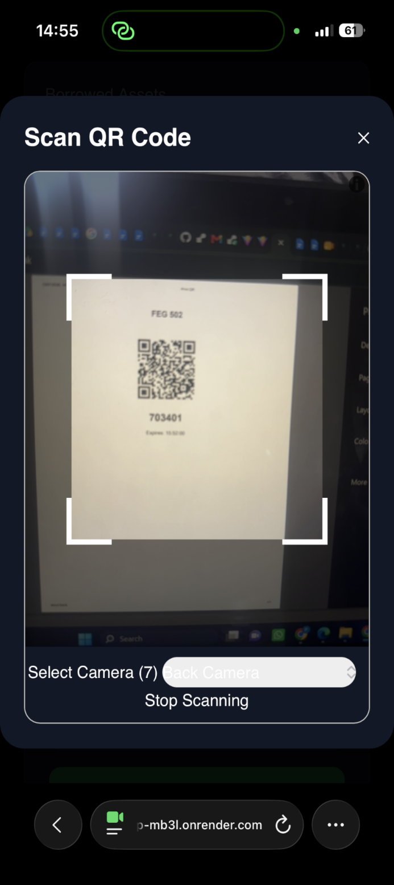

# QR-Based Attendance & Asset Management System

A web-based academic management system designed to improve **student attendance tracking and institutional asset management** using QR codes, geolocation verification, and role-based access control.

The system provides separate dashboards for **students, lecturers/administrators, and institutional management**, allowing attendance sessions to be created and monitored in real time while also providing a structured workflow for borrowing and returning institutional assets.

---

## 📌 Project Overview

Traditional attendance systems often rely on manual sign-in sheets or verbal roll calls. These approaches can be slow, difficult to monitor, and vulnerable to attendance fraud such as students signing in for one another.

At the same time, institutional assets such as laboratory equipment, computers, projectors, and other resources may be difficult to track when borrowing and returning are handled manually.

This project combines both problems into a single web application.

The system allows lecturers or administrators to:

* Create class schedules.
* Create individual class sessions.
* Generate unique QR codes for active sessions.
* Set the physical location of a class.
* Monitor attendance records.
* Add notes to class sessions.
* Manage institutional assets.

Students can:

* View their enrolled courses.
* View current and upcoming classes.
* Scan a session QR code.
* Submit attendance using a session code.
* Have their location verified against the class location.
* Borrow institutional assets.
* Return borrowed assets.
* View their attendance records.

---

# 🎯 Objectives

The major objectives of the project are to:

1. Develop a digital attendance system using QR codes.
2. Reduce manual attendance-taking processes.
3. Reduce attendance impersonation and proxy attendance.
4. Introduce location-based verification into attendance recording.
5. Provide lecturers with centralized attendance records.
6. Provide students with an easy method of marking attendance.
7. Develop a structured institutional asset borrowing and return system.
8. Provide role-based access to different parts of the system.
9. Maintain digital records that can be retrieved and analyzed later.
10. Demonstrate the practical application of modern web technologies to an educational management problem.

---

# ✨ Key Features

## 👨‍🎓 Student Dashboard

Students have access to a centralized dashboard containing:

* Attendance statistics
* Enrolled courses
* Borrowed assets
* Current and upcoming classes
* Attendance QR scanner
* Manual attendance code entry
* Asset borrowing
* Asset return
* Attendance history

---

## 📱 QR-Based Attendance

Lecturers can generate a unique QR code for a specific class session.

The QR contains session information such as:

```json
{
  "sessionId": "SESSION_ID",
  "code": "SESSION_CODE"
}
```

When a student scans the QR code:

1. The QR code is decoded.
2. The session ID and session code are extracted.
3. The student’s current location is obtained.
4. The information is sent to the backend.
5. The server validates the session.
6. The server validates the session code.
7. The server checks the QR expiration time.
8. The student's location is compared with the class location.
9. The student's course enrollment is verified.
10. Duplicate attendance is prevented.
11. Attendance is recorded.

This makes the attendance process more controlled than simply entering a static code.

---

# 📍 Location-Based Attendance Verification

The system uses browser geolocation to obtain the student's current coordinates.

Example:

```json
{
  "lat": 6.8068136163518265,
  "lng": 3.1033688001973507
}
```

The class session also contains a predefined location:

```json
{
  "lat": 6.807828250443525,
  "lng": 3.0999495821998817,
  "name": "Lecture Hall"
}
```

The backend calculates the distance between the two coordinates using the **Haversine formula**.

The system then determines whether the student is within the permitted attendance radius.

Conceptually:

```text
Student Location
       ↓
Get Latitude & Longitude
       ↓
Backend
       ↓
Compare with Session Location
       ↓
Calculate Distance
       ↓
Within Allowed Radius?
      / \
    YES  NO
     ↓    ↓
 Record   Reject
Attendance
```

The location check is performed on the **server**, rather than relying solely on frontend validation.

---

# ⏱️ Session & QR Expiration

Attendance sessions are associated with specific dates and class times.

A QR code is only valid during a defined period surrounding the class.

The backend stores:

```text
date
startTime
endTime
qrExpiresAt
sessionActive
```

When attendance is submitted, the server checks whether the QR code has expired.

For example:

```js
if (new Date() > session.qrExpiresAt) {
  return res.status(400).json({
    message: "Session expired"
  });
}
```

This prevents students from using an old QR code after the attendance period has ended.

---

# 🔐 Attendance Validation

Attendance requests go through several validation stages.

### 1. Session Validation

The server confirms that the referenced session exists.

### 2. Session Code Validation

The submitted code must match the code generated for that session.

### 3. Expiration Validation

The QR/session must still be valid.

### 4. Location Validation

The student must be within the permitted distance of the class location.

### 5. Enrollment Validation

The student must be enrolled in the course associated with the session.

### 6. Duplicate Validation

A student cannot submit attendance for the same session more than once.

The overall flow is:

```text
QR Scan
   ↓
Session Found?
   ↓
Code Valid?
   ↓
Session Active?
   ↓
QR Expired?
   ↓
Location Valid?
   ↓
Student Enrolled?
   ↓
Already Attended?
   ↓
Record Attendance
```

---

# 👨‍🏫 Session Management

Administrators/lecturers can create class schedules and generate individual sessions.

A schedule contains information such as:

```text
Course
Day of Week
Start Time
End Time
```

A session represents a specific occurrence of that class:

```text
Course
Date
Start Time
End Time
Location
Schedule
```

This distinction allows one recurring schedule to generate multiple individual class sessions.

For example:

```text
Schedule
   │
   ├── Week 1 Session
   ├── Week 2 Session
   ├── Week 3 Session
   └── Week 4 Session
```

---

# 📅 Weekly Sessions

The system supports generating multiple weekly class sessions.

For example, a lecturer can define:

```text
Course: EEE 501
Day: Monday
Time: 10:00 - 12:00
Weeks: 4
```

The system generates the corresponding session dates automatically.

---

# ⚡ Impromptu Classes

The system also supports classes that are not part of a recurring weekly schedule.

An administrator can create an impromptu class by specifying:

* Course
* Date
* Start time
* End time
* Location

This allows the system to handle both scheduled and unexpected academic activities.

---

# 📝 Session Notes

Administrators can attach notes to individual class sessions.

For example:

```text
Class moved to Laboratory 2.
Guest lecturer present.
Practical examination.
```

Each note is stored with its creation timestamp.

---

# 🧰 Asset Management

The project also contains an institutional asset management component.

Students can request to:

* Borrow an asset
* Return an asset

The system tracks asset transactions and their approval states.

The student dashboard also provides an overview of currently borrowed assets.

The system can therefore be extended to manage resources such as:

* Computers
* Projectors
* Laboratory equipment
* Electronics
* Tools
* Books
* Other institutional resources

---

# 👥 Role-Based System

The application is designed around different user responsibilities.

## Student

Students can:

* View courses
* View schedules
* Scan attendance QR codes
* Submit attendance
* View attendance records
* Borrow assets
* Return assets

## Lecturer / Administrator

Administrators can:

* Create schedules
* Create sessions
* Create impromptu classes
* Generate QR codes
* View attendance
* Add session notes
* Manage class locations
* Manage assets

---

# 🏗️ System Architecture

The application follows a client-server architecture.

```text
┌──────────────────────────────┐
│        Vue Frontend          │
│                              │
│  Student Dashboard           │
│  Admin Dashboard              │
│  QR Scanner                   │
│  Forms & Interfaces           │
└──────────────┬───────────────┘
               │
               │ HTTP / REST API
               ↓
┌──────────────────────────────┐
│       Express Backend        │
│                              │
│ Authentication               │
│ Attendance                   │
│ Sessions                     │
│ Schedules                    │
│ Assets                       │
│ Enrollment                   │
└──────────────┬───────────────┘
               │
               │ Mongoose
               ↓
┌──────────────────────────────┐
│          MongoDB             │
│                              │
│ Users                        │
│ Courses                      │
│ Enrollments                  │
│ Schedules                    │
│ Sessions                     │
│ Attendance                   │
│ Assets                       │
└──────────────────────────────┘
```

---

# 🛠️ Technology Stack

## Frontend

* **Vue 3**
* **Vite**
* **Tailwind CSS**
* **JavaScript**
* **HTML5 Geolocation API**
* **html5-qrcode**

## Backend

* **Node.js**
* **Express.js**
* **JavaScript**
* **REST API**

## Database

* **MongoDB**
* **Mongoose**

## Additional Technologies

* QR Code generation
* QR Code scanning
* Browser Geolocation API
* Haversine distance calculation
* JWT-based authentication
* RESTful API architecture

---

# 📂 Project Structure

A simplified representation of the project structure:

```text
project/
│
├── frontend/
│   ├── src/
│   │   ├── components/
│   │   │   ├── admin/
│   │   │   └── student/
│   │   │
│   │   ├── views/
│   │   │   ├── StudentDashboard.vue
│   │   │   └── AdminSchedule.vue
│   │   │
│   │   ├── services/
│   │   │   └── api.js
│   │   │
│   │   └── router/
│   │
│   ├── package.json
│   └── vite.config.js
│
├── backend/
│   ├── controllers/
│   │   ├── attendanceController.js
│   │   ├── sessionController.js
│   │   └── scheduleController.js
│   │
│   ├── models/
│   │   ├── Attendance.js
│   │   ├── Enrollment.js
│   │   ├── Session.js
│   │   ├── Schedule.js
│   │   └── ...
│   │
│   ├── routes/
│   │   ├── attendanceRoutes.js
│   │   ├── sessionRoutes.js
│   │   └── scheduleRoutes.js
│   │
│   ├── utils/
│   │   └── generateQR.js
│   │
│   └── server.js
│
└── README.md
```

---

# 🗄️ Core Data Models

## User

Stores student and administrator information.

Example responsibilities:

```text
Name
Email
Password
Role
```

---

## Course

Represents an academic course.

```text
Course Code
Course Title
```

---

## Enrollment

Connects a student to a course.

```text
Student
Course
```

---

## Schedule

Represents a recurring academic timetable.

```text
Course
Day of Week
Start Time
End Time
```

---

## Session

Represents a specific class occurrence.

```text
Schedule
Course
Date
Start Time
End Time
Location
QR Code
QR Expiration
Session Code
Session Status
Notes
```

---

## Attendance

Stores a student's attendance for a particular session.

Conceptually:

```text
Student
Course
Schedule
Session
Timestamp
```

This structure makes it possible to generate attendance reports by student, course, schedule, or session.

---

# 🔄 Attendance Workflow

The complete attendance process is:

```text
ADMIN
  │
  ├── Create Schedule
  │
  ├── Create Session
  │
  ├── Define Class Location
  │
  └── Generate QR
          │
          ↓
      QR Displayed
          │
          ↓
STUDENT
  │
  ├── Opens Dashboard
  │
  ├── Scans QR
  │
  ├── QR decoded
  │
  └── Browser requests location
          │
          ↓
      REST API Request
          │
          ↓
BACKEND
  │
  ├── Find Session
  ├── Validate Code
  ├── Validate Expiration
  ├── Calculate Location Distance
  ├── Verify Enrollment
  ├── Check Duplicate Attendance
  │
  └── Save Attendance
          │
          ↓
       SUCCESS
```

---

# 📍 Distance Calculation

The system uses the Haversine formula to calculate the approximate distance between two geographic coordinates.

```js
const getDistance = (loc1, loc2) => {
  const toRad = (val) =>
    (val * Math.PI) / 180;

  const R = 6371e3;

  const dLat =
    toRad(loc2.lat - loc1.lat);

  const dLng =
    toRad(loc2.lng - loc1.lng);

  const a =
    Math.sin(dLat / 2) *
      Math.sin(dLat / 2) +
    Math.cos(toRad(loc1.lat)) *
      Math.cos(toRad(loc2.lat)) *
      Math.sin(dLng / 2) *
      Math.sin(dLng / 2);

  const c =
    2 *
    Math.atan2(
      Math.sqrt(a),
      Math.sqrt(1 - a)
    );

  return R * c;
};
```

The result is returned in meters.

---

# 🔒 Security Considerations

The system performs important validation on the backend rather than trusting the frontend.

Examples include:

* Session existence validation
* Session code validation
* QR expiration validation
* Course enrollment validation
* Duplicate attendance prevention
* Location verification
* Authentication and authorization

Frontend validation is treated primarily as a user-experience feature, while important business rules are enforced by the backend.

---

# ⚠️ Geolocation Considerations

Browser-based geolocation is dependent on the device and environment.

Accuracy may vary based on:

* GPS availability
* Wi-Fi positioning
* Mobile network information
* Browser permissions
* Device hardware
* Indoor environments

For this reason, the attendance radius is configurable rather than assuming that browser geolocation will always provide centimeter-level accuracy.

For a production deployment, the appropriate radius should be determined based on the institution's physical environment and testing results.

---

# 🚀 Getting Started

## Prerequisites

Make sure the following are installed:

* Node.js
* npm
* MongoDB or MongoDB Atlas
* Git

---

# 📥 Installation

Clone the repository:

```bash
git clone <repository-url>
```

Enter the project directory:

```bash
cd <project-directory>
```

---

# Frontend Setup

Navigate to the frontend:

```bash
cd frontend
```

Install dependencies:

```bash
npm install
```

Start the development server:

```bash
npm run dev
```

---

# Backend Setup

Navigate to the backend:

```bash
cd backend
```

Install dependencies:

```bash
npm install
```

Create a `.env` file:

```env
PORT=5000
MONGO_URI=your_mongodb_connection_string
JWT_SECRET=your_secret
```

Start the backend:

```bash
npm run dev
```

---

# 🔑 Environment Variables

Do not commit private credentials to GitHub.

Example:

```env
PORT=5000
MONGO_URI=your_mongodb_connection_string
JWT_SECRET=your_jwt_secret
```

Use a `.gitignore` file containing:

```gitignore
node_modules/
.env
dist/
```

---

# 🧪 Testing the System

A basic demonstration can be performed using the following workflow.

### Step 1 — Create a Course

Create an academic course in the administrator interface.

### Step 2 — Enroll a Student

Associate a student account with the course.

### Step 3 — Create a Schedule

Define:

```text
Course
Day
Start Time
End Time
```

### Step 4 — Create a Session

Create a specific class session and provide its location.

### Step 5 — Generate QR

Generate the QR code for the active session.

### Step 6 — Student Scan

Log in as the student and scan the displayed QR code.

### Step 7 — Location Verification

The system obtains the student's current coordinates.

### Step 8 — Attendance Validation

The backend validates the session, code, expiration, location, enrollment, and duplicate status.

### Step 9 — Attendance Recorded

If all conditions are satisfied, the attendance record is created.

---

# 🧪 Example Attendance Request

The frontend sends information similar to:

```json
{
  "sessionId": "SESSION_ID",
  "code": "102040",
  "userLocation": {
    "lat": 6.806813,
    "lng": 3.103368
  }
}
```

The backend then performs the necessary validations before creating the attendance record.

---

# ❌ Example Validation Failures

The API can reject an attendance request when:

```text
Session not found
```

```text
Invalid session code
```

```text
Session expired
```

```text
You are not within class location
```

```text
You are not enrolled in this course
```

```text
Attendance already recorded
```

This provides clear feedback to the student while keeping the actual validation logic on the server.

---

# 📊 Potential Reports

Because attendance records are stored against students, courses, schedules, and sessions, the system can be extended to produce reports such as:

### Student Report

```text
Student
Course
Sessions Attended
Sessions Missed
Attendance Percentage
```

### Course Report

```text
Course
Session
Number Present
Number Absent
Attendance Percentage
```

### Session Report

```text
Session Date
Course
Student
Attendance Time
Status
```

---

# 🔮 Future Improvements

Possible future improvements include:

* Attendance percentage calculations
* Automated absence detection
* CSV/PDF attendance reports
* Lecturer-specific dashboards
* Email notifications
* Push notifications
* More advanced analytics
* Attendance trends and charts
* GPS accuracy indicators
* Configurable geofencing per classroom
* QR code rotation
* Stronger device/session verification
* Offline attendance synchronization
* Native Android deployment
* NFC-based attendance
* Facial verification as an optional secondary verification mechanism
* Administrative audit logs

---

# 🎓 Academic Significance

This project demonstrates how modern software engineering techniques can be applied to solve practical problems within an educational institution.

It combines:

* Web application development
* Database design
* REST API development
* Authentication
* QR technology
* Geolocation
* Geographic distance calculation
* Role-based access
* Data management
* Hardware/resource management

The system is therefore more than a simple QR scanner. It demonstrates the design and implementation of a complete client-server application for managing academic activities and institutional resources.

---

# 📸 Project Screenshots

## Screenshots

### Student Dashboard


### QR Attendance Scanner



### Admin Dashboard


### Asset Management


---

# 🤝 Contribution

This repository represents an academic final-year project.

Contributions, suggestions, and technical feedback are welcome.

If you would like to propose an improvement:

1. Fork the repository.
2. Create a feature branch.
3. Implement your changes.
4. Commit your changes.
5. Open a pull request.

---

# 📄 License

This project was developed as part of an academic final-year project.

Unless otherwise stated, the source code is provided for educational and demonstration purposes.

---

# 👨‍💻 Author

**Patrick**

Final-Year Electrical Engineering Student
Full-Stack Developer

### Technologies

```text
Vue.js
Vite
Tailwind CSS
Node.js
Express.js
MongoDB
Mongoose
JavaScript
QR Code
Geolocation API
REST APIs
```

---

## ⭐ Project Summary

The **QR-Based Attendance & Asset Management System** provides a centralized platform for managing classroom attendance and institutional resources.

By combining QR-based session identification with server-side validation, course enrollment checks, duplicate prevention, and location verification, the system provides a practical digital alternative to traditional attendance processes.

At the same time, its asset management functionality provides institutions with a structured way to monitor the borrowing and return of physical resources.

The project demonstrates the application of modern full-stack development techniques to a real-world educational problem.
